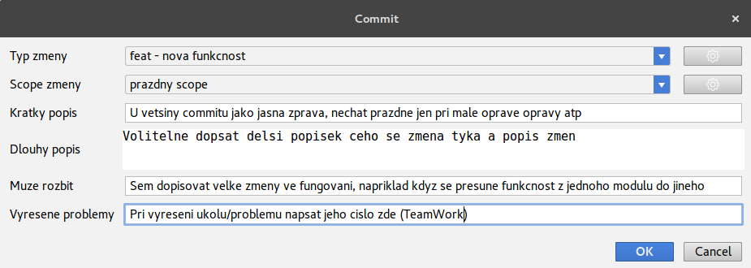
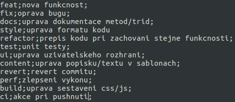

# git commit template UVM

Plugin pro phpstorm na správné šablony pro commit message

Pomoci ozubenych kolecek vpravo nahore muzeme upravit url k .csv souborum.

# Nastavení možností scope a typů commitů

Moznosti scope a typy zmen se importuji do selectu z .csv ktere umistime na verejnou adresu.

V nastavení pluginu je možné tyto URL změnit (kdyby došlo k přesunutí).

Takto může vypadat csv pro typy commitů. První sloupec je označení, které se propíše do commitu při zvolení této možnosti. Druhý sloupec je pro pomocný popisek.